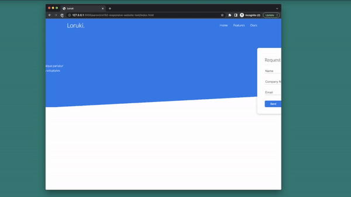

# Build a Responsive Website
## HTML, CSS Grid, Flexbox & More

Learn By Doing! Now that you have experience with HTML and CSS from our course, you are now ready for the next challenge. 

Follow along with the video to make a template for your responsive website. Explanations are built in to the demonstration.

**You do not have to deploy your website to Netlify as in the video**

Link to video is [here](https://www.youtube.com/watch?v=p0bGHP-PXD4)

Link to the ***FREE*** font-awesome 5.15.1 libraries is [here](https://cdnjs.com/libraries/font-awesome/5.15.1)

Link to the ***FREE*** Lato Google Font is [here](https://fonts.google.com/specimen/Lato?query=lato)

Feel free to look around font-awesome for the newer libraries and Google Fonts for inspiration on your next projects.

This project will take you through the following:
-   Base & Navbar HTML
-   Base CSS
-   Navbar, Container, Flex
-   Showcase Area & Grid
-   Card & Form CSS
-   Button Styes
-   Skewed Area
-   Stats Section
-   Utility Classes - Margin & Padding
-   CLI Section & Grid Columns & Row Span
-   Cloud Section
-   Background & Button Utility Classes
-   Text Sizes
-   Programming Languages Section
-   Footer
-   Media Queries & Responsiveness
-   Features Page
-   Features Grid With Spans
-   Docs Page
-   Alert, Code Block & Text Color Styles
-   Make Inner Pages Responsive
-   CSS Animations

**TIP:** It is not recommended to do this all in one sitting if this is your first time. Take breaks!

When you are finished with the above, submit your repo URL to get credit for this assignment.

Most of all, have fun and enjoy this assignment!
